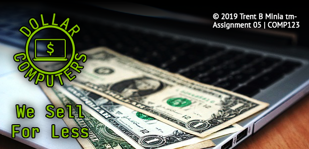
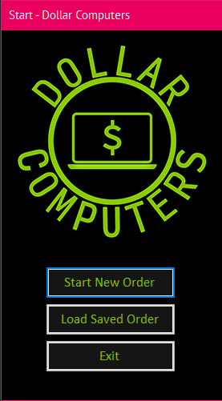
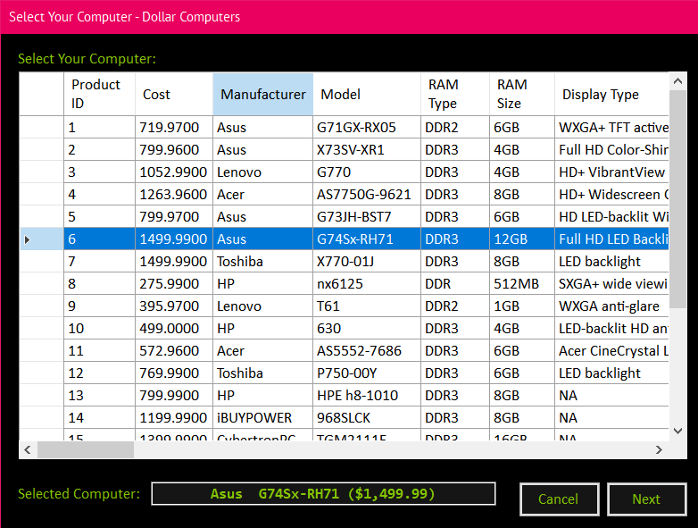
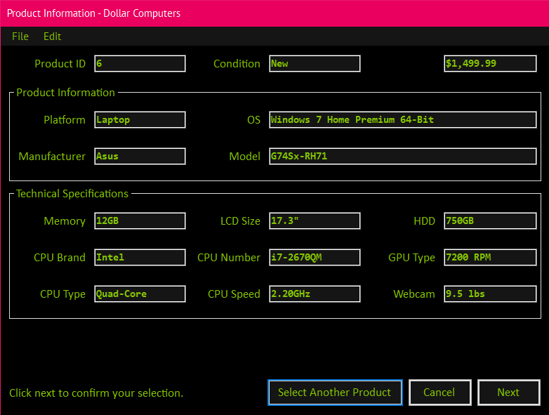
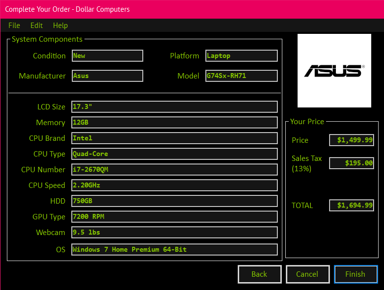
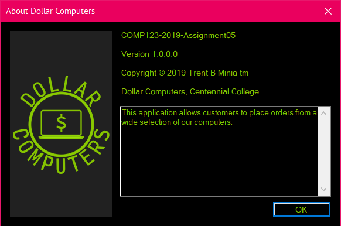
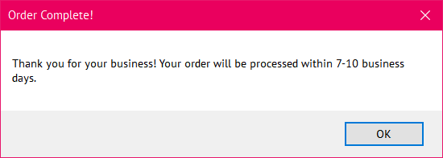

# Dollar Computers

**Assignment 5 | COMP123 Programming II**
**Centennial College**

This is the git repository for Dollar Computers. This app was created as an 
assignment for COMP123 Programming II at Centennial College.

# Overview

Upon starting the application, the application splash screen will show for a few 
seconds.

The splashscreen image, if memory serves correctly, was taken from Pixabay, and
edited in Adobe Photoshop CS6.

Once the splashscreen disappears, the main menu UI will appear. From here, the 
user will be able to select the following options:

 * Start New Order
 * Load Saved Order
 * Exit 

If the user has started a previous order and saved it, they can reload the order
through the **Load Saved Order** button. Orders are saved as *.txt* files.

The logo was created in Adobe Photoshop CS6.

Once a new order is started, the user can view a list of computers they can 
choose from. The *Selected Computer* field will change depending on the currently 
highlighted computer in the list box.

After the user is satisfied with their selection and click the *Next* button,
they will be able to view information and specs about the computer in a more 
organized fashion. The menu toolbar provides different options the user can 
choose:

  * `File`
    * `Open`: Open an existing order already started
    * `Save`: Save the current order
  * `Edit`
    * `Select Another Product`: Go back to the previous screen and select another
     computer

The **Select Another Product** button at the bottom functions the same way as 
the `Edit` > `Select Another Product` menu function.

Upon clicking **Next**, the user will be able to view and confirm their order 
befor completing it. The user will be able to view pricing information, 
including the base price, the sales tax, and the total amount after taxes.

The menu toolbar in this windows form provides the following options:

  * `File`
    * `Print`: This will display a dialogue that says 'Printing your order...'
               (This doesn't actually print anything!)
  * `Edit`
    * `Back`: Goes back to the previous screen/form
  * `Help`
    * `About`: Shows the *About Dollar Computers* form

The order will have been "confirmed" after the user clicks **Finish**. This 
doesn't really do anything, other than just close the application.

# Requirements

The following is a list of requirements as outlined in the assignment sheet for 
Assignment 5:

## Overview

# Disclaimer

I was very proud of how my implementation of Assignment 5 Dollar Computers had 
turned out. It is one of the assignments from COMP123 at Centennial College that 
I've decided to showcase for my personal website. With that said, it is possible 
that the instructions for this assignment are unchanged, or have been slightly 
modified since I took the course. I am _not responsible_ for any plagiarism that 
takes place in the event that my code is copied and submitted for evaluation.